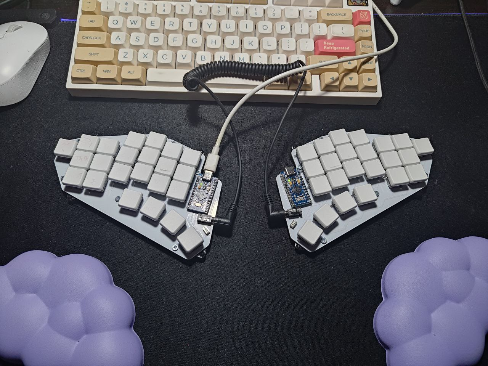
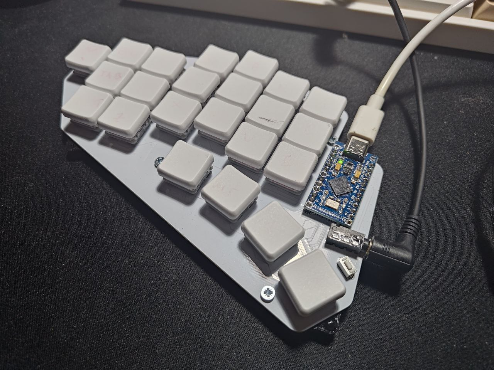
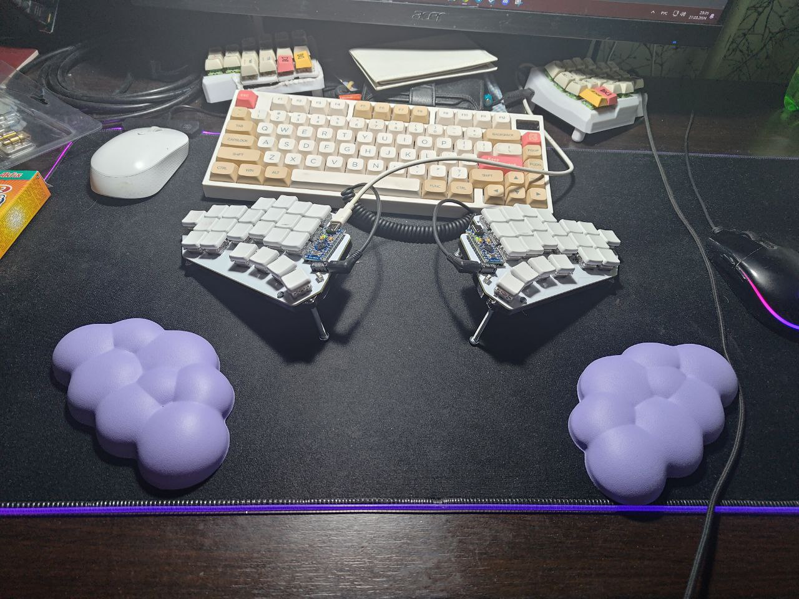
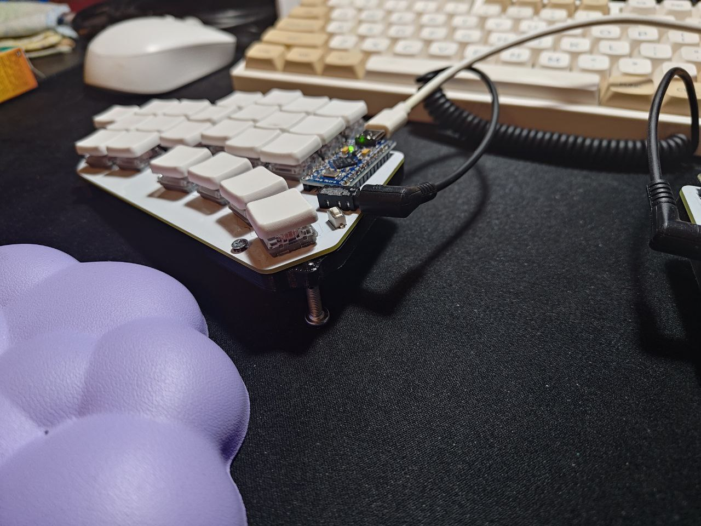

# JCUKEN

Cyrillic-friendly low profile ortholinear split keyboard.

## Tools

Designed with [ergogen](https://github.com/ergogen/ergogen).

Routed with [KiCad](https://www.kicad.org/).

## Version 1

### Top view

### Close up view

### High stands

### Low stands

## Materials

| Part                      | Link                                                                        | Price                     |
| ------------------------- | --------------------------------------------------------------------------- | ------------------------- |
| PCB (5 pcs)               | [link](https://aliexpress.ru/store/1100324072?g=y&page=1&searchInfo=search) | 25$                       |
| ProMicro (2 pcs)          | [link](https://aliexpress.ru/item/1005005787284179.html)                    | 5$                        |
| Diods (100 pcs)           | [link](https://aliexpress.ru/item/1005006043982096.html)                    | 1$                        |
| Reset buttons (100 pcs)   | [link](https://aliexpress.ru/item/4000533166385.html)                       | 1$                        |
| TRRS cable                | [link](https://aliexpress.ru/item/1005003415667083.html)                    | 2$                        |
| Switches (70 pcs)         | [link](https://aliexpress.ru/item/1005005883472162.html)                    | 27$                       |
| TRRS connectors (10 pcs)  | [link](https://aliexpress.ru/item/1005003299392377.html)                    | 1$                        |
| Hot swap sockets (70 pcs) | [link](https://aliexpress.ru/item/1005006007846154.html)                    | 10$                       |
| Keycaps (50pcs)           | [link](https://aliexpress.ru/item/1005004558099208.html)                    | 22$                       |
| Case                      | [link](https://github.com/Snikimonkd/JCUKEN/tree/main/case)                 | 2$ (3 beers for my buddy) |
| Bolts/Stands (10 pcs)     | Local hardware store                                                        | 1$                        |
| **Total**                 |                                                                             | **~97$**                  |

